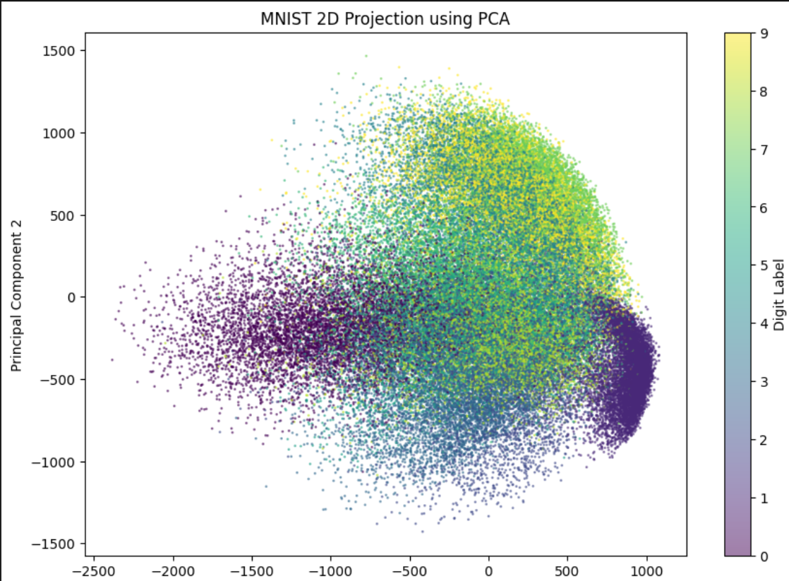
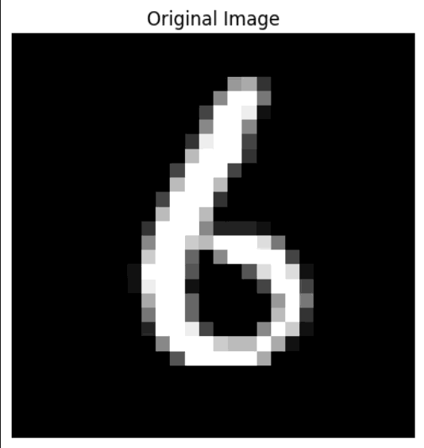

# MNIST Dimensionality Reduction 🧮
📉 Dimensionality reduction on the MNIST dataset using PCA implemented from scratch with NumPy. Features variance analysis, eigenvalue decomposition, and 2D projections of handwritten digits


## Table of Contents  

1. [About](#about)  
2. [Features](#features)  
3. [Requirements](#requirements)  
4. [Installation](#installation)  
5. [Usage](#usage)  

---

## About

The **MNIST Dimensionality Reduction** project is an exploration of **Principal Component Analysis (PCA)**, one of the most fundamental techniques in unsupervised machine learning and data compression.

The project utilizes the **MNIST dataset**, a famous collection of 70,000 grayscale images of handwritten digits. Built entirely from scratch using **NumPy**, this implementation moves beyond high-level libraries to dive into the core linear algebra of the algorithm. By performing **Eigenvalue Decomposition** on the covariance matrix, the project demonstrates how 784-dimensional pixel data can be projected onto a much smaller subspace. 

The main objective is to visualize the underlying structure of the data in 2D and explore the mathematical "sweet spot" where data can be significantly compressed while maintaining its essential characteristics.

---

## Features

- **From-Scratch PCA Implementation**: A complete Principal Component Analysis class built using NumPy, featuring manual covariance matrix calculation and eigenvalue decomposition.
- **Dimensionality Reduction**: Efficiently compresses 784-dimensional pixel data into any $n$-dimensional subspace for visualization or storage optimization.
- **2D Data Visualization**: Generates a scatter plot of the top two principal components, revealing the natural clustering and separation of the 10 digit classes.
- **Reconstruction Module**: Includes a custom function to project reduced data back into the original 784-dimensional space to assess information loss.
- **Interactive Component Comparison**: Visual validation of reconstruction quality across different dimensions (e.g., $n=3, 10, 100$), demonstrating the trade-off between compression and clarity.
- **Matrix Property Analysis**: Verifies the mathematical foundations of PCA by visualizing the orthonormality of eigenvectors ($V^TV$) and the reconstruction projection ($VV^T$).
- **Robust Data Preprocessing**: Custom centering and scaling logic to ensure the MNIST samples are correctly prepared for linear transformation.

---
## Requirements

- **Python 3.x**: The core programming language used for the project.  
- **Jupyter Notebook environment**: VS Code (with Jupyter extension), JupyterLab, or Google Colab to run the `.ipynb` file.  
- **NumPy**: For efficient numerical computations and matrix operations.  
- **Scikit-Learn**: Specifically used for fetching the MNIST dataset and splitting the data.
- **Matplotlib**: For generating graphs and visualizing the non-linear decision boundaries.  
- **Git**: To clone the repository.


---
## Installation

### 1. Clone the repository
```bash
git clone https://github.com/Amit-Bruhim/MNIST-Dimensionality-Reduction.git
```

### 2. Navigate into the project folder
```bash
cd MNIST-Dimensionality-Reduction
```

### 3. Install required libraries
```bash
pip install numpy scikit-learn matplotlib
```

### 4. Open and Run the Notebook
Open the file `src/pca_mnist_implementation.ipynb` using VS Code or upload it to Google Colab.  

You can then click **"Run All"** to execute the training and see the results.

*Tip: You don't have to run the code to see the results; you can simply scroll through the notebook to view the pre-saved outputs and graphs.*

---
## Usage

### 1. Dimensionality Reduction & Visualization 📉
The project starts by reducing the 784-dimensional MNIST images into a 2D space. This allows us to visualize how the PCA algorithm naturally clusters different digits based on their visual features.  


### 2. Matrix Property Analysis
We verify the mathematical integrity of our PCA implementation by examining the products of our eigenvector matrix $V$:
* **$V^T V$**: Confirms the orthonormality of the principal components (resulting in an Identity Matrix).
* **$V V^T$**: Visualizes the projection matrix back into the original 784-dimensional space.  


### 3. Image Reconstruction 🔄
A key feature of this project is the ability to reconstruct images from a reduced number of dimensions. We can observe the "lossy" nature of PCA by comparing the original digit to its reconstruction using 3, 10, or 100 components.  



---
